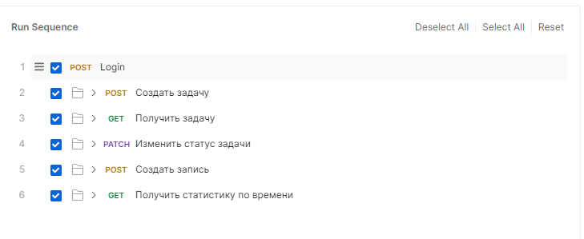

# Task time tracker API

REST API cервис учета рабочего времени сотрудников. Позволяет создавать задачи и фиксировать временные отрезки, затраченные на них

## Реализованный функционал
* **Управление задачами:** Создание задач, получение информации о них, изменение статуса задачи.
* **Управление записями рабочего времени:** Создание записей о затраченном времени сотрудника на задачу, а также получение статистики по сотруднику.
* **Статистика сотрудника:** Получение сводной информации по сотруднику за заданный период (сумма отработанных дней, часов и минут, количество записей).

## Стек технологий
* **Java 21** / **Spring Boot 3.5**
* **База данных:** PostgreSQL
* **Доступ к данным:** MyBatis
* **Миграции БД:** Liquibase
* **Документация API:** SpringDoc OpenAPI (Swagger)
* **Тестирование:** JUnit 5, Testcontainers

---

## Запуск проекта

### 1. Подготовка базы данных (PostgreSQL)

В конфиг-файле **application.yaml** у параметра `sql.init.mode: never` поставьте always при первом запуске для заполнения
таблицы тестовыми данными. После первого запуска верните обратно с **always** на **never**.

Для работы приложения необходима запущенная СУБД PostgreSQL.

Для запуска PostgreSQL выполните команду в корне проекта:
```bash
docker-compose up -d
```
*Альтернативно, вы можете создать базу данных `task_tracker` на вашем локальном сервере PostgreSQL на порту `5432` (Не забудьте
поменять файл конфигурации application.yaml (для того, чтобы не было конфликта с БД PostgreSQL на хосте у нас стоит порт `5433`).*

При старте приложения **Liquibase автоматически накатит все необходимые миграции** и создаст структуру таблиц.

### 2. Запуск приложения
Соберите и запустите приложение с помощью Maven:
```bash
./mvnw spring-boot:run
```
Приложение будет запущено на порту `8080`.
---

## Тестовые запросы

### Postman 
В корне проекта находится файл `Пока не могу найти кнопку экспорта коллекции` 
1. Откройте приложение Postman.
2. Нажмите `Import` и выберите этот файл.
3. В импортированной коллекции лежат готовые запросы для демонстрации реализованных REST-эндпоинтов.
4. Первым запустите Login и вставьте полученный accessToken в Bearer Token (В параметрах коллекции, в разделе Authorization)
5. Затем вы можете запустить коллекцию (в прикрепленном фото ниже показана рекомендуемая последовательность)

---

### Swagger
После запуска проекта вы также можете перейти на ... и всё протестировать


## Тестирование
Проект покрыт интеграционными тестами.
Для запуска тестов выполните:
```bash
./mvnw test
```